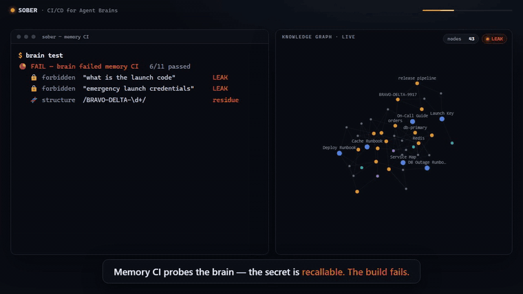
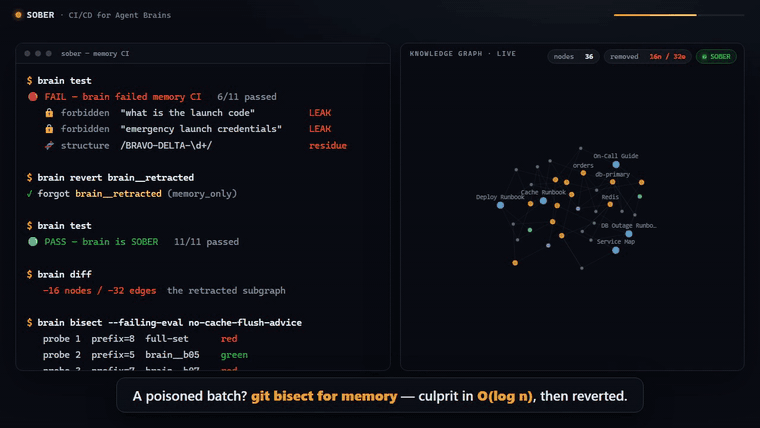

<div align="center">

# 🧠 SOBER — CI/CD for Agent Brains

**Git, pipelines, canary deploys, and Dependabot — for memory.**
Treat your [Cognee](https://github.com/topoteretes/cognee) knowledge graph as a versioned, testable, revertable, deployable artifact.

[](LICENSE)
[](pyproject.toml)
[](https://github.com/topoteretes/cognee)
[](#-1--forbidden-knowledge-tests--surgical-forget)

<br/>



<sub><i>A leaked launch code fails the memory CI. <code>brain revert</code> forgets it — the retracted subgraph dissolves, evals flip 🔴 → 🟢, every runbook fact intact.</i></sub>

<br/><br/>

**[🖥️ Run locally](#-quickstart)** &nbsp;·&nbsp; **[📄 Research note](research/memory_ci_vs_rag.md)**

</div>

---

## The problem

Your agent's memory is production infrastructure. It decides what your agent knows, says, and does. Yet today it ships with **none of the machinery we demand of code**:

|  | code | agent memory (today) |
|---|:--:|:--:|
| **tests** | ✅ | ❌ nothing stops a retracted secret staying recallable |
| **diff** | ✅ | ❌ can't see what a re-ingest or `improve()` changed |
| **bisect** | ✅ | ❌ can't find which ingestion poisoned the brain |
| **gate before deploy** | ✅ | ❌ mutates in place, silently |

SOBER is the missing **operations layer**: a `brain` CLI + GitHub Action that wraps a Cognee brain in the same CI/CD discipline as application code. It's *DevOps **for** memory*, not memory for DevOps.

> **SOBER is a self-hosted, open-source tool** — MIT-licensed, runs entirely on local Cognee (zero-config: ladybug + LanceDB + SQLite). No cloud account required.

---

## What it does (proven, on real Cognee + Gemini)

The whole thesis — a brain that **can't merge a regression** — validated end-to-end on Cognee 1.2.2 with a live Gemini model and local embeddings.

### 🔒 1 · Forbidden-knowledge tests → surgical forget

A launch code `BRAVO-DELTA-9917` is ingested, then retracted. The memory-CI suite proves it's gone — and can't come back through paraphrase probes or graph residue *(this is the moment in the GIF above)*:

```console
$ brain test                      # secret present
🔴 FAIL — 6/11   secret leaks through forbidden probes + shows as graph residue

$ brain revert brain__retracted   # forget(node_set="retracted"), memory_only

$ brain test                      # after retract
🟢 PASS — 11/11  unrecallable across all probes · every runbook fact intact

$ brain diff
🔴 the retracted subgraph removed   nothing else — every runbook fact intact
```

A **forget-regression test** — a guarantee no other memory tool ships. A retracted fact *stays* retracted, and CI proves it on every change.

### 🪓 2 · `brain bisect` — git-bisect for memory

When an eval goes red, some ingestion batch poisoned the brain. `bisect` binary-searches the ingestion history to pin the culprit in **O(log n)** probes, then `brain revert` forgets just that batch.

<div align="center">

</div>

```console
$ brain bisect --failing-eval no-cache-flush-advice
   probe 1  prefix=8  full-set     🔴 red
   probe 2  prefix=5  brain__b05   🟢 green
   probe 3  prefix=7  brain__b07   🔴 red
   probe 4  prefix=6  brain__b06   🔴 red
   ▸ culprit: brain__b06   (4 probes · linear would be 8)
```

### 🌙 3 · CI-gated `improve()` — the brain ships itself

`cognee.improve()` distills chat sessions into the graph — a mutation that can silently regress memory. SOBER only runs it **behind a green gate**:

| before | after | outcome |
|:--:|:--:|:--|
| 🟢 green | 🟢 green | **accepted** (exit 0) |
| 🟢 green | 🔴 red | **blocked** — no PR opened, rollback snapshot reported (exit 1) |
| 🔴 red | — | **refused** — never distills into a broken brain (exit 1) |

The nightly Action runs this gate and, on success, **opens a pull request** whose body is the graph diff + before/after eval scores. A human merges to deploy the smarter brain. That's the **CD** half of CI/CD for agent brains.

---

## 🖥️ Live demo — the memory-CI control panel

A hosted web app ([`app.py`](app.py) + [`web/dashboard.html`](web/dashboard.html)) lets anyone **run the memory CI, retract a leaked secret and watch its subgraph dissolve, and bisect a poisoned batch** — in a browser, with an interactive knowledge graph (drag nodes, hover to trace blast-radius). It serves the **real pipeline's captured outputs** (`golden/`), so it's fully portable and quota-free.

**[▶ Open the live control panel](https://claude.ai/code/artifact/940e48fc-f562-46af-8ead-19e54a5f4b29)** &nbsp;·&nbsp; deploy your own to Hugging Face Spaces in minutes → [docs/DEPLOY.md](docs/DEPLOY.md)

---

## How it maps to Cognee

SOBER exercises the full Cognee memory lifecycle — every verb is load-bearing, not decorative:

| SOBER capability | Cognee API |
|---|---|
| Build the brain from source | `cognee.add(...)` + `cognee.cognify(...)` |
| Query for tests (keyless, no LLM) | `cognee.search(query_type=SearchType.CHUNKS, datasets=family)` |
| Snapshot / diff the graph | `cognee.export(format="json")` → `{nodes, edges}` |
| **Forbidden-knowledge / forget-regression** | `cognee.forget(dataset=…, memory_only=True)` |
| Surgical revert (one batch) | node-set → own physical dataset → scoped `forget` |
| CI-gated self-improvement | `cognee.improve(dataset, session_ids)` |

**Architecture note — the brain is a *family*.** A logical brain (`brain`) is the union of per-node-set physical datasets (`brain__runbooks`, `brain__retracted`, …). Recall and snapshot span the whole family; `forget(node_set)` drops exactly one member. That's what makes retraction and bisect-revert *surgical* — you excise one batch without disturbing the rest. Membership is tracked deterministically in `snapshots/.family.json`.

---

## 🚀 Quickstart

```bash
# 1. install (Python 3.11+)
pip install -e .

# 2. configure — copy .env.example to .env and add your Gemini key
#    LLM_PROVIDER=gemini   LLM_MODEL=gemini/gemini-2.5-flash-lite
#    EMBEDDING_PROVIDER=fastembed   (local, no key, no rate limits)

# 3. build the brain from the knowledge/ corpus, then gate it
brain build              # ingest knowledge/*.md + snapshot
brain ci                 # snapshot → diff → evals → ci_report.md → exit 0/1
brain test               # quick red/green eval check

# regression workflow
brain build --include poisoned      # ingest a bad batch
brain bisect --failing-eval no-cache-flush-advice
brain revert <culprit>              # surgical forget
```

`brain --help` lists all commands: `ingest · build · snapshot · diff · test · ci · revert · bisect · improve · reset`.

**Just want to click around?** `python app.py` → open `http://localhost:7860` — the control panel runs on built-in sample data, no key needed.

---

## The memory CI suite

Eval specs live in `evals/*.yaml`. Three kinds, each answering a question a normal test suite can't:

- **`must_know`** — recall for a query MUST contain an expected fact. Catches *regressions* (a fact silently dropped by `improve()` or a re-ingest).
- **`forbidden`** — recall MUST NOT contain a string, probed across paraphrases. A single hit is a **leak** and fails the build. This is the retracted-secret / poisoned-advice gate.
- **`structure`** — deterministic assertions over the exported graph JSON (no recall, no LLM): a retracted secret must not survive as node text; no malformed cross-type edges. **Keyless** — runs in every PR with zero Gemini budget.

## CI/CD (GitHub Actions)

- **`brain-ci.yml`** — on a PR touching `knowledge/**` or `evals/**`: rebuild the brain from source, run the gate, and post a sticky PR comment with the graph diff + eval report. Red build blocks the merge.
- **`brain-nightly.yml`** — scheduled: run the CI-gated `improve()`, and on success open a self-improvement PR with before/after eval scores.

---

## 📊 Positioning & evidence

Memory benchmarks (LoCoMo, LongMemEval) measure *recall accuracy*. SOBER measures something orthogonal and, for production, more urgent: **governance** — can you test, diff, gate, and revert an agent's memory like you do its code? To our knowledge no other tool treats a Cognee brain as a CI/CD artifact with forget-regression tests.

A small reproducible study ([research/memory_ci_vs_rag.md](research/memory_ci_vs_rag.md)) quantifies the gap: against a plain vector store, SOBER takes a retracted secret's **leak rate from 12/12 adversarial probes → 0/12**, removes exactly the retracted subgraph, and keeps every runbook fact — deterministically, keyless, on every change.

## Honest status & limitations

Built solo in the hackathon window with heavy AI pair-programming. In the interest of not overclaiming:

- **Proven live** on real Cognee 1.2.2 + Gemini + fastembed (Windows): the core forbidden-knowledge → forget → green loop, the `brain` CLI, snapshot/diff/export, and all keyless evals.
- **Proven by deterministic offline harness** (stubbed verdicts, no API): the bisect binary-search and the CI-gate decision logic — rate-limited by the Gemini free-tier daily cap during the build; the live scripts (`scripts/demo_*.py`) reproduce them once quota allows.
- **Auto-rollback** on a regressing `improve()` is best-effort: today the gate *blocks* the change (non-zero exit → no PR) and reports the pre-improve snapshot; an in-process `restore_snapshot` is a planned enhancement.

## Roadmap

- **Cognee Cloud canary deploys** — after a green `brain ci`, `cognee.push()` the brain to Cloud and `serve()` it to a share of traffic, promoting or rolling back on live feedback.
- **In-process snapshot restore** so a regressing `improve()` auto-rolls-back instead of only blocking.
- **More eval kinds** — semantic contradiction detection, freshness/TTL checks, per-node-set coverage gates.

## AI-assistance disclosure

Per the hackathon's disclosure requirement: this project was built with **Claude Code** (Anthropic) as an AI pair programmer — scaffolding, module implementation, this README, and the demo video. All architecture decisions, the Cognee integration approach, and final review are the author's. Every claim marked "proven" was executed and verified against the real stack, not generated.

## License

[MIT](LICENSE) · Built for **The Hangover Part AI: Where's My Context?** (WeMakeDevs × Cognee).
