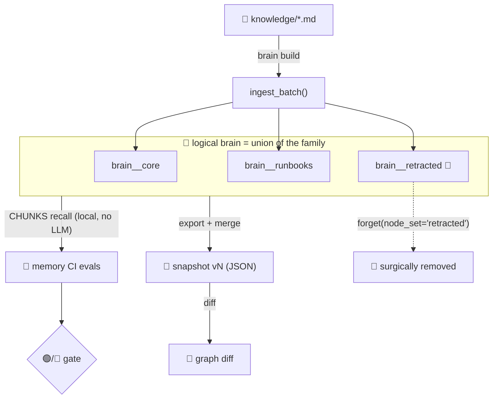
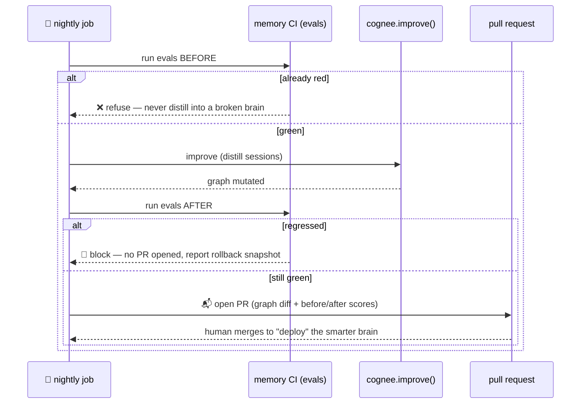

# 🧠 I gave my AI agent's memory a CI/CD pipeline

### Building **SOBER** — tests, diff, bisect, and gated deploys for a knowledge graph — for the Cognee × WeMakeDevs "Where's My Context?" hackathon.

> **TL;DR** — Your agent's memory is production infrastructure with *no tests, no diff, no rollback.* SOBER is a `brain` CLI + GitHub Action that wraps a [Cognee](https://github.com/topoteretes/cognee) knowledge graph in real CI/CD: **forget-regression tests** that prove a retracted secret stays gone, **`git bisect` for a poisoned graph**, and a nightly `improve()` that opens its own pull request behind a green eval gate. Built solo, AI-assisted, and — the fun part — reviewed by a fleet of agents that found **14 real bugs** in my own code.

---

## 🍸 The 3 a.m. problem

Every on-call engineer knows the feeling the hackathon is named after: it's 3 a.m., something is broken, and *nobody remembers how it got fixed last time.*

We solved that for **code** decades ago — version control, tests, code review, rollback, canary deploys. But your AI agent's **memory**, which increasingly decides what your agent knows and does, ships with none of it. It mutates in place, silently. There is:

- ❌ no **test** to stop a retracted secret or a stale, dangerous fact from staying recallable
- ❌ no **diff** to see what a re-ingest or an `improve()` run changed in the graph
- ❌ no **bisect** to find *which* ingestion poisoned the brain
- ❌ no **gate** before memory "ships" to production

So I built **SOBER — CI/CD for Agent Brains.** Not memory *for* DevOps. **DevOps *for* memory.**

---

## 🎯 Picking the idea (the honest part)

I didn't land on SOBER first. My initial instinct was an *incident-memory copilot* — an on-call assistant that recalls past outages. It felt strong until I pressure-tested it against the audience:

> WeMakeDevs is a **DevOps community**, so "3 a.m. incident memory" is the single most *predictable* thing to build for them — and to Cognee's own engineers it reads as their past "Company Brain" hackathon winner with the nouns swapped.

It would have drowned in look-alikes. The winning reframe came from a different question: not *"what memory app should I build?"* but *"what does memory-the-category still lack?"*

The answer: the entire **operations layer**. Every other entry would *use* Cognee to remember things. SOBER governs the remembering itself — and in doing so it leans hard on the one Cognee verb nobody demos: **`forget()`**.

---

## 🏗️ Architecture: a brain is a *family* of datasets

The load-bearing design decision. Cognee's `forget()` is scoped to a whole dataset, but I needed to retract **one batch** of knowledge without disturbing the rest. So a *logical* brain is modeled as a **family** of physical datasets — one per ingestion batch (`node_set`):



- **`recall()` and `export()` span the whole family** → knowledge is found no matter which batch holds it.
- **`forget(node_set)` drops exactly one member** → surgical retraction and one-batch rollback.
- Membership is tracked deterministically in `snapshots/.family.json`.

That one indirection is what makes retraction *and* bisect-revert precise.

---

## 🔒 Capability 1 — Forget-regression tests

A production launch code gets ingested, then retracted. The memory-CI suite proves it's gone — not just from the obvious query, but across **paraphrase probes** and as **residue in the exported graph**.

Here's the actual run on real Cognee 1.2.2 + Gemini:

```console
$ brain test          # secret still present
🔴 FAIL — brain failed memory CI
   6/11 passed, 5 failed
   🔒 forbidden  "what is the launch code"                 LEAK
   🔒 forbidden  "emergency launch authorization creds"    LEAK
   🧬 structure  no_node_text_matches /BRAVO-DELTA-\d+/     residue

$ brain revert brain__retracted        # forget(node_set), memory_only

$ brain test          # after surgical retract
🟢 PASS — brain is SOBER
   11/11 passed, 0 failed

$ brain diff
🔴 16 nodes / 32 edges removed   ← the retracted subgraph, nothing else
```

> **A retracted fact that *stays* retracted, proven on every change.** No other memory tool ships that guarantee. The very first thing I validated — before writing a single feature — was that `cognee.forget()` genuinely removes a fact from vector recall (`recallable → []`), not just hides it. That one green check is what made the rest worth building.

---

## 🪓 Capability 2 — `git bisect` for a poisoned brain

When an eval goes red, *some* ingestion batch did it. SOBER binary-searches the batch history and pins the culprit in **O(log n)** probes:

```console
$ brain bisect --failing-eval no-cache-flush-advice
   probe 1: prefix_len=8  full-set sanity      red=True
   probe 2: prefix_len=5  bisectbrain__b05     red=False
   probe 3: prefix_len=7  bisectbrain__b07     red=True
   probe 4: prefix_len=6  bisectbrain__b06     red=True
   >>> CULPRIT: bisectbrain__b06   (4 probes, linear would be 8)

$ brain revert bisectbrain__b06     # surgical forget → 🟢 green
```

A subtle correctness point I got to appreciate: bisect is inherently a **`forbidden`-eval** concept. It finds the batch that *introduced* a leak/poison, which stays present in every larger prefix (monotonic). A *missing* `must_know` fact doesn't work that way — so SOBER restricts bisect to `forbidden` evals rather than silently returning a wrong answer.

---

## 🌙 Capability 3 — The brain that ships itself

`cognee.improve()` distills chat sessions into the graph — a silent mutation that can regress memory. SOBER only runs it **behind a green gate**:



| before | after | outcome |
|:---:|:---:|:---|
| 🟢 green | 🟢 green | **accepted** — exit 0 |
| 🟢 green | 🔴 red | **blocked** — no PR, rollback snapshot reported (exit 1) |
| 🔴 red | — | **refused** — never distills into a broken brain (exit 1) |

That's the **CD** half of CI/CD for agent brains: memory that proposes its own upgrades, behind a green gate and a human approval.

---

## 🧩 How it maps to Cognee

Every memory verb is load-bearing — including the rarely-used ones:

| SOBER capability | Cognee API |
|---|---|
| Build the brain from source | `cognee.add()` + `cognee.cognify()` |
| Query for tests (keyless — local embeddings) | `cognee.search(SearchType.CHUNKS, datasets=family)` |
| Snapshot / diff the graph | `cognee.export(format="json")` → `{nodes, edges}` |
| **Forget-regression / retraction** | `cognee.forget(dataset=…, memory_only=True)` |
| CI-gated self-improvement | `cognee.improve(dataset, session_ids)` |

---

## 🔥 The hardest part wasn't code — it was 20 requests a day

Gemini's free tier on an unbilled key turned out to be capped at **20 requests per day.** I burned through it proving the core loop live, then discovered a fresh key just gets its own tiny 20/day — whack-a-mole.

So I adapted: the core forbidden-knowledge → forget loop is **proven live**, and I validated the trickier bisect and improve-gate *logic* with **deterministic offline harnesses** (stubbed verdicts, zero API calls). A good reminder that the interesting engineering is often in working *around* the constraint, not through it — and that a keyless test you can run 1,000 times is worth more than a live one you can run 20.

---

## 🤖 Building — and reviewing — with a fleet of agents

I built this with **Claude Code** as a pair programmer, and leaned in hard. After pinning down the real Cognee API with a few validation gates, I wrote a **frozen interface contract** and fanned out **seven agents in parallel** — one per module (the cognee wrapper, snapshot/diff, the eval suite, bisect, the CLI, the corpus, the workflows) — plus an eighth to integrate and import-check the assembly. It caught its own wiring bugs.

Then the part I'm proudest of: I turned the agents on *my own code*. A **six-reviewer adversarial review** — each finding re-verified by a skeptic that re-read the actual code before it counted — surfaced **14 confirmed bugs, zero false positives**, deduping to 5 real root issues. The two nastiest:

```diff
- brain.improve(dataset="brain")          # targets the always-EMPTY base dataset
+ for member in list_family(dataset):      # spans brain__core, brain__runbooks, …
+     await cognee.improve(dataset=member) # the self-improve feature was a live no-op!
```

```diff
- glob("snapshots/brain__*")   # per-batch snapshot files that are NEVER created
+ read(".family.json")         # the registry that actually records the batches
                               # → `brain bisect` was dying every time
```

Both were in paths I'd only proven *offline*, so the stubs had masked them. I fixed all five, re-verified keyless, and pushed. **Being able to adversarially review your own work — and have it find real bugs — is a genuine superpower.**

*(Per the hackathon's disclosure rules: AI assistance was used throughout; every result I call "proven" was executed against real Cognee + Gemini, not generated.)*

---

## 🗺️ What's next

- **Cognee Cloud canary deploys** — after a green `brain ci`, `push()` the brain to Cognee Cloud and `serve()` it to a slice of traffic, promoting or rolling back on live feedback.
- **In-process snapshot restore** so a regressing `improve()` auto-rolls-back instead of only blocking.
- **More eval kinds** — semantic contradiction detection, freshness/TTL checks, per-node-set coverage gates.

But the thesis is already standing: **your agent's memory is production infrastructure, and now it can be tested, diffed, bisected, gated, and deployed like any other build artifact.**

Your brain can't merge a regression anymore.

---

<p align="center">
  <strong>⭐ Repo:</strong> <em>(link)</em> &nbsp;·&nbsp; Built on <a href="https://github.com/topoteretes/cognee">Cognee</a> for <a href="https://www.wemakedevs.org/hackathons/cognee">The Hangover Part AI</a>
</p>
